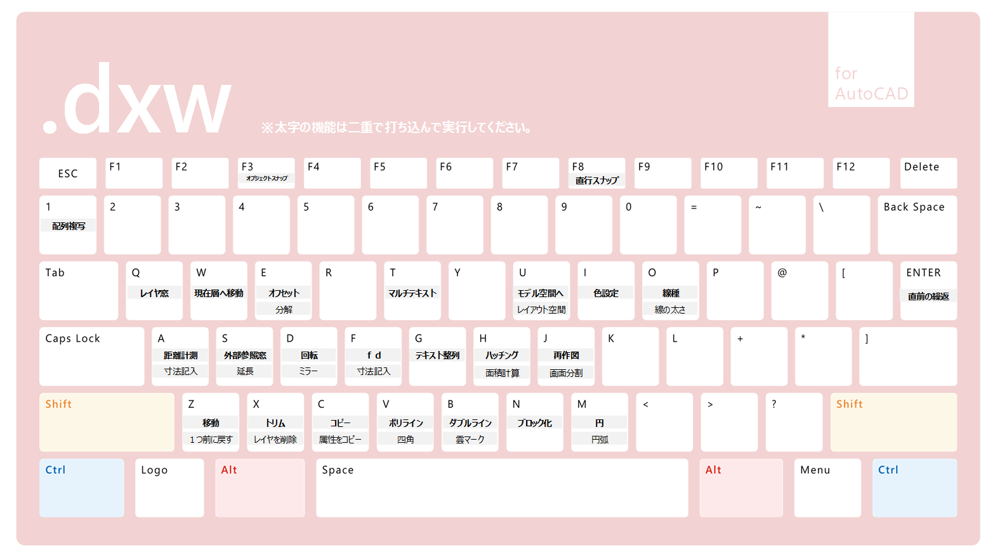

# AutoCADエイリアス設定

## エイリアス設定
　

```A,          *DIST
AA,         *DIM
E,          *OFFSET
EE,	*EXPLODE
N,          *BLOCK
C,          *COPY
1,         *ARRAY
H,          *HATCH
Q,	*LAYER
Z,          *MOVE
T,         *MTEXT
G,	*TEXTALIGN
ZZ,         *OOPS
D,         *ROTATE
DD,          *MIRROR
M,          *CIRCLE
V,         *PLINE
VV,        *RECTANG
B,         *DLINE
BB	 *REVCLOUD 
W,	*LAYMCUR
X,         *TRIM
XX,	*LAYDEL
S,         *XREF
SS,        *EXTEND
U,         *MSPACE
UU,         *PSPACE
JJ,	*VPORTS
CC,	*MATCHPROP
J,	*REGEN
JJ,         *DIM
MM,         *ARC
I,         *COLOR
N,         *BLOCK

O,         *LINETYPE
OO,         *LWEIGH
```
### その他のコマンド
OP：オプション画面を開く
DS：詳細設定を開く

## その他の操作のポイント　
* 図中にShiftキー押しながら右クリックで一時的にスナップモードになる
* @マーク付きで座標入力すると相対座標系に切り替わる
* Ctrl + Shift + C で基点を指定してコピー。
* AutoCADではコマンドの前に「-」をつけるとGUIではなくCUIで操作するものとしてコマンドが実行される。

