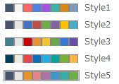

# 図解・図版用カラーパレット
1000色以上の大型パレット。

## これは？
もともとデザイナーとして出版物などを作っていたりしたこともあり、ちまちま集めたカラーパレットがたくさんありました。フォーマルな社内報のパレットや、微妙な色の違いを集めたアースカラーのパレット、アカデミミックな図解・グラフを作成するためのパレット等々ごちゃまぜのちゃんぽんパレットです。色相環で等距離になるよう配色を選んでいるので、図解・図版向けに使いやすいと思います。

## ダウンロード
主要なデザイニングソフトそれぞれのパレットファイルを作成しました。自分の使うソフトに合わせてダウンロードしてください。
* [AdobePhotoshop.aco](contents/AdobePhotoshop.aco)
* [AffinityDesigner.afpalette](contents/AffinityDesigner.afpalette)
* [InkscapePallet.gpl](contents/InkscapePallet.gpl)

## Officeでも使いたいんだけど
WordやPowerPointでも使いたい人もいると思います。オフィス系ではアクセントカラーの色数が制限されているのでパレットをそのまま使うのは難しいのですが特に使いやすいパレットを用意しました。

**C:\Users\ユーザ名\AppData\Roaming\Microsoft\Templates\Document Themes\Theme Colors**に以下のファイルをダウンロードして入れるとカラーテーマを利用できるようになります。

* [Style1](contents/Style1.xml)
* [Style2](contents/Style2.xml)
* [Style3](contents/Style3.xml)
* [Style4](contents/Style4.xml)
* [Style5](contents/Style5.xml)

###### おまけ
Officeソフトのカラーパレットに気に入っっているVimのカラースキームをそのまま移行したパレットを作成しました。使うと黒背景を前提として映えるカラーパレットなので画面上で大量のグラフを確認したり、テクニカルなプレゼンテーションで使えるパレットかなと思います（エンジニアっぽいカラースキームなので）。

* [DaiVim](contents/DaiVim.xml)
